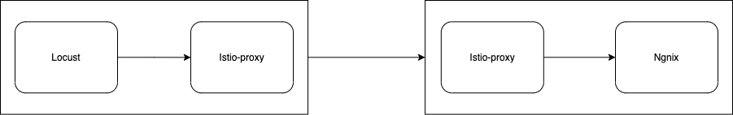
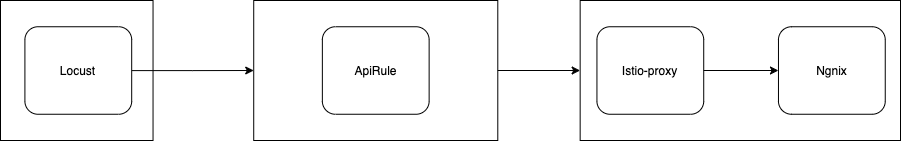

# Performance tests for Kyma

## Instructions
1. Install Kyma on the cluster
2. Run instruction `helm install kyma-perf-tests kyma-perf-tests-chart` with selected parameters

## Parameters
| Name  | Description| Default  | 
| ------|:----------:| :-------:|
| users    | Number of concurrent Locust users.       | 10        | 
| hatchRate    | The rate per second in which users are spawned.       | 10       | 
| host    | Host to load test in the following format: http://10.21.32.33 |         | 
| runTime    |   Stop after the specified amount of time       | 5m20s        | 
| locustfile    | Python module file to import       | /mnt/locust/locustfile.py       | 
| testCaseNumber    | Number of test case (1->Internal communication, 2->External communication)       | 1       | 
| clusterDomain    | Specific domain for cluster. Using in ApiRule       | default       | 
| namespace    | Namespace where Locust will be installed        | kyma-perf-tests      | 


## Test cases: 
### Internal communication (beetwen pods in cluster)


```console
export CLUSTER_DOMAIN=$(kubectl get cm shoot-info -n kube-system -o jsonpath='{.data.domain}')
helm install kyma-perf-tests kyma-perf-tests-chart --set testCaseNumber=1 --set clusterDomain=$CLUSTER_DOMAIN --set namespace=perf-tests --wait
```

#### Hyperscaler: Azure

| Users | req/s | avg  | mediana |p(99)|p(99.9)|p(99.99)|
| ------|:-----:| :---:|:----:  |---: |-----:|-----: |
| 10    | 2280  | 4   | 4       | 15  | 21   | 27    |
| 20    | 2336  | 7   | 6       | 28  | 34   | 39    |
| 30    | 2340  | 11  | 10      | 36  | 43   | 49    |
| 40    | 2419  | 14  | 12      | 41  | 49   | 56    |
| 50    | 2461  | 18  | 16      | 46  | 55   | 63    |

#### Hyperscaler: AWS

| Users | req/s | avg  | mediana |p(99)|p(99.9)|p(99.99)|
| ------|:-----:| :---:|:----:  |---: |-----:|-----: |
| 10    | 2271  | 4   | 4       | 12  | 18   | 22    |
| 20    | 2293  | 7   | 7       | 25  | 30   | 36    |
| 30    | 2355  | 11  | 10      | 30  | 36   | 42    |
| 40    | 2375  | 14  | 13      | 36  | 43   | 49    |
| 50    | 2411  |  18 | 17      | 40  | 47   | 54    |

#### Delta (Azure - AWS)

| Users | req/s | avg  | mediana |p(99)|p(99.9)|p(99.99)|
| ------|:-----:| :---:|:----:  |---: |-----:|-----: |
| 10    | 9  | 0   | 0      | 3  | 3   | 5    |
| 20    | 43  | 0   | -1       | 3  | 4   | 3   |
| 30    | 44  | 0 | 0      | 6  | 7   | 7    |
| 40    | 44  | 0  | -1      | 5  | 6   | 7    |
| 50    | 50  |  0 | -1      | 6  | 8   | 9    |


### External communication 

* Locust is inside the cluster
```console
export CLUSTER_DOMAIN=$(kubectl get cm shoot-info -n kube-system -o jsonpath='{.data.domain}')
helm install kyma-perf-tests kyma-perf-tests-chart --set testCaseNumber=2 --set clusterDomain=$CLUSTER_DOMAIN --set namespace=perf-tests --wait
```

#### Hyperscaler: Azure

| Users | req/s | avg  | mediana |p(99)|p(99.9)|p(99.99)|
| ------|:-----:| :---:|:----:  |---: |-----:|-----:  |
| 10    | 1215  | 7    | 7      | 17  | 27   | 37     |
| 20    | 1388  | 14   | 13     | 26  | 35   | 43     |
| 30    | 1364  | 20   | 20     | 33  | 41   | 49     |
| 40    | 1383  | 27   | 26     | 41  | 50   | 59     |
| 50    | 1406  | 34   | 32     | 58  | 69   | 81     |


#### Hyperscaler: AWS

| Users | req/s | avg  | mediana |p(99)|p(99.9)|p(99.99)|
| ------|:-----:| :---:|:----:  |---: |-----:|-----:  |
| 10    |  1074 | 9    | 9      | 17  | 26   | 46     |
| 20    | 1233  | 15   | 15     | 26  | 39   | 69     |
| 30    |  1266 | 22   | 21     | 35  | 47   | 83     |
| 40    | 1274  | 29   | 28     | 44  | 55   | 120    |
| 50    | 1276  | 36   | 36     | 54  | 68   | 110    |

#### Delta (Azure - AWS)

| Users | req/s | avg  | mediana |p(99)|p(99.9)|p(99.99)|
| ------|:-----:| :---:|:----:  |---: |-----:|-----:  |
| 10    |  141 | -2    | -2      | 0  | 1   | -9     |
| 20    | 155  | -1   | -2     | 0  | -4   | -26     |
| 30    |  98 | -2   | -1     | -2  | -6   | -34     |
| 40    | 109  | -2   | -2     | -3  | -5   | -61    |
| 50    | 130  | -2   | -4     | 4  | 1   | -29    |
